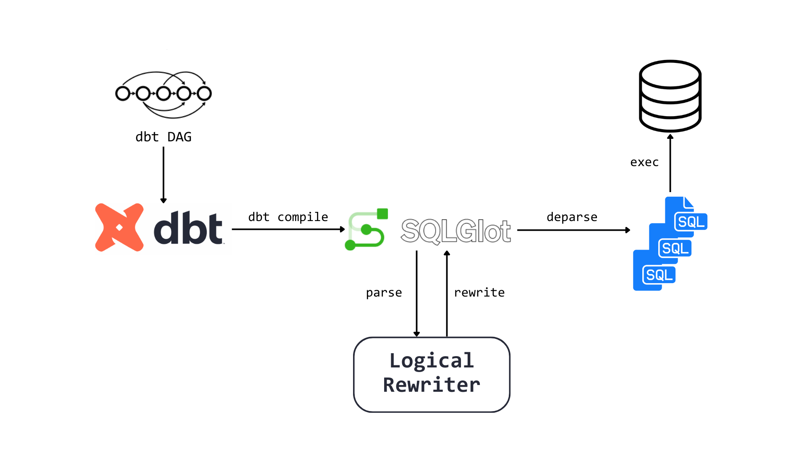

# Multi-Query Optimization Framework

## Overview

### Context
dbt (Data Build Tool) is a widely used SQL-centric tool for data transformation. Given a set of SQL files as input, dbt compiles them into a Directed Acyclic Graph (DAG) by analyzing user-defined dependencies (for example, SQL file A might depend on the table produced by SQL file B). Then dbt executes each node in this DAG directly, producing materialized tables or views.

However, dbt itself is not designed to optimize these SQL queries before execution. Therefore, there are opportunities for multi-query optimizations that could further improve performance.

### Goal
Our main goal is to explore ways of rewriting the DAG (i.e., the compiled SQL queries) to achieve better query execution performance. We have three milestone goals:

In this project, we have three milestone goals:

#### 75% goal: 
- Generate a workload for benchmarking dbt’s DAGs ✅
- Implement a DAG rewriter with at least the predicate pushdown heuristic ✅

#### 100% goal:
- Implement all the proposed logical query optimizations for multiple queries 🆗
- Evaluate the DAG using the benchmark ✅

#### 125% goal:
- Explore and implement Physical query optimization (e.g. cache & reuse of intermediate “subresults”) ❌
- (Revised) Inject statistics from DBMS ✅

## Architectural Design

### Execution module
- We decided to implement our own execution module, separate from dbt. This choice allows us to focus on DAG rewriting while having stronger control over execution and workload evaluation.

1. Obtain a topological ordering of the DAG’s nodes (each node corresponds to a single SQL query). This order could be changed afte optimization because the DAG could get changed.
2. Execute the queries in DuckDB in that topological order. Each query is typically doing a materialization for a table or view.
3. The details of this module’s design and interaction with DuckDB are described in the Testing Plan section below.

### Parser & Deparser
We use SQLGlot for parsing dbt compiled SQL files into abstract syntax trees (ASTs), as well as backward conversion from ASTs to SQLs. Parsing the SQL queries into ASTs allows us to canonicalize and modify queries with guaranteed semantic correctness, which is ideal for the logical rewriter module. Note that in the actual implementation, a part of the parser is fused into the rewriter for easier AST manipulation. 

### Logical Rewriter
The rewriter contains the core logic for dbt DAG optimization, using a heuristics approach. It takes the DAG, its dbt manifest, and a mapping of query nodes to their ASTs (from the parser). Once initialized, rules can be attached to the rewriter such that they are checked and applied during rewrite in their append order. The DAG and AST mapping are modified in-place, and passed to the deparser once the rewrite process ends. 

The rewriter is also extensible in a similar style as Calcite. New rules can be implemented via extending the `RewriteRule` class, which has 2 abstract methods: `match()` and `apply()`. 
- `match()` check if the rule is applicable to the target DAG node given current context, and optionally returns a matched-rule context on success
- `apply()` performs transformations as defined by the rule to the target DAG node, if `match()` succeeds and optionally feeds matched-rule context 

This provides great flexiblility to the rule implementations, including potential structural changes to the DAG, and modification of DAG nodes outside of current scope, both of which can be useful for more complex and scenario-specific rules. 

#### Statistics Injection
Since some of the optimizations may not worth to do, the rewriter may extract statistics from the DBMS and use them to determine whether it should apply the optimizations or not. 

In this project, we use statistics to choose whether we should do predicate pushdown since a predicate pushdown may generate more intermediate data. More specifically, we extract cardinality estimated by the DBMS and compute selectivity based on the estimation. Currently, we use a simple heuristic that if the selectivity is greater than a certain threshold (configurable), we will apply the rule.

Note that this feature is experimental; there are many things that can be explored.

## Design Rationale

The primary goal of our design is to enable extensibility and be as modular as possible, whiling having maximum control over each stage of the pipeline. These are enabled in our optimizer framework via the completely standalone execution module and its submodules, where each block is assigned a logically self-contained functionality. Using this approach, new modules can be freely attached and old modules can be freely detached. It is also beneficial for debugging, since we are able to inspect each block separately. Rule-level extensibility is also achieved in the rewriter in Calcite style as explained earlier. 

Some alternatives we considered include feeding the DAG back to dbt after optimization. This could not be done because `dbt compile` simply outputs the actual SQLs that would be executed in a `dbt run` without `CREATE` statement, and is solely for debug/analysis/inspection purposes. This means dbt does not provide an interface for either 'decompiling' an already compiled DAG, or running a compiled DAG directly, even if it were not optimized. That implies we either have to build our own execution framework, or have the optimizer modify dbt DAGs directly. The later is not achievable as well, given that no other existing tool is able to parse dbt DAGs, except for dbt itself. 

## Testing Plan
We will measure both the correctness and the performance of the rewritten DAG compared to the original DAG.

Because there are few open-source DAG benchmark workloads, we plan to create our own, inspired by TPC-H. We will load TPC-H tables as the underlying raw data, then build data-model queries from the standard TPC-H queries. For each of our rewrite rules, we will construct DAGs that can benefit from that rule, thereby demonstrating the resulting performance improvement. We also use the limited set of open-source DAG workloads (e.g., dbt-dummy, jaffle-shop) to demonstrate the real-world impact.

### Correctness check
To verify that our optimized SQL produces the same results:
1. We do `dbt run` normally and query the materialzed results to record the materialized tables/views. This is the expected results. 
2. We apply our optimizations to rewrite the DAG.  
3. We execute the optimized DAG and compare the final materialized tables/views with the original outputs (by running a separate query to fetch all rows).

### Performance evaluation and benchmark
1. We rely on DuckDB’s internal profiling command `EXPLAIN ANALYZE` for multiple runs. Each run uses a cold cache (i.e., a fresh session) to ensure consistent timing. After these runs, we collected and compared the execution time (sum, avg, tail, etcs). 
2. We found that DuckDB may automatically scale different numbers of threads based on running environment. To prevent inconsistent results due to concurrency, we set a fixed number of threads (currently 1) for every run.
3. For each rewrite rule we develop, we would create a specialized set of DAGs that could benefit from that rule.

## Trade-offs and Potential Problems

### Rewriter
The current implementation of the rewrite does not check for rules exhaustively in the graph. Each rule instance is check once for each DAG node in the DAG's topological sort order. This may overlook cases such as: 
1. Rule is applicable to new node created by current rule
2. Rule is applicable to parent once transformation is applied on child (e.g. predicate can be pushed down >1 layers)
3. A previously checked rule is applicable to some node after current rule's transformations

## Future Work
### Rewriter
From the heuristics perspective, there can always be more rules added to the rewriter. We can try to identify new rules that can may improve overall performance.

From the generic query optimization perspective, there can potentially be a cost-based optimization design. We have introduced a proof-of-concept for using statistics to selectively choose to apply the heuristics; this could be the first step towards the cost-based optimization. However, since dbt DAGs are structured completely different from simply queries, it will require a more in-depth discussion.

### Physical optimizations
We may look into some potential physical optimizations such as different caching techniques to further improve DAG executions. This might require looking into dbt internals and can take some effort. 

### Real-world evaluation
It is important to see whether this is useful in the real-world dbt or not. It would be nice to have a lot of badly-written real-world DAG workloads to evaluate the usefulness.